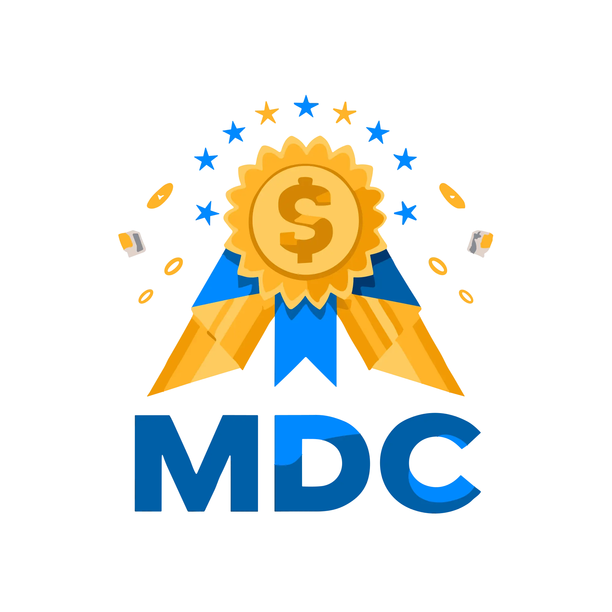

<h1>Projeto - MDC - Método Dominando Comissões</h1>
Type: Landig Page

Link: <a href="https://rafagui.github.io/PROJETO_MDC_GABRIEL/">Projeto - MDC</a>

<h2>Sobre o Projeto:</h2><br>
Este projeto, feito exclusivamente a pedido do cliente, foi criado com o intuito de realizar a venda de info produtos de sua autoria.
<br>

```bash(html)
              <section class="content-block">
                <div class="content-image-logo">
                    
                </div>
                <div class="content-imagem">
                    
                </div>
                <div class="content-text">
                    <p>
                        Descubra <span class="blur-text">como conquistar uma renda em dólar e real</span>sem precisar aparecer através das melhores estratégias do Brasil, Aprenda 100% online e trabalhando no conforto do seu lar.
                    </p>
                </div>
                <div class="content-main-text">
                    <p>
                        Domine a arte de aumentar seus ganhos em 5x, independentemente de ser iniciante ou não tendo conhecimento do idioma inglês.
                    </p>
                </div>
            </section>
```
##Tecnologias Usadas:
HTML, CSS e JavaScript

<h3>Autor: Rafael William</h3>
<h4>Linkedin: <a href="https://www.linkedin.com/in/rafael-william-5885b5209/">Meu Linkedin</a></h4>
